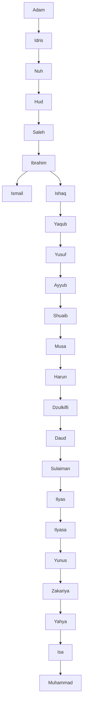

Geneologi para nabi. Klik nama nabi untuk melihat kisahnya.

```mermaid
graph TD
    Adam --> Idris
    Idris --> Nuh
    Nuh --> Hud
    Hud --> Saleh
    Saleh --> Ibrahim
    Ibrahim --> Ismail
    Ibrahim --> Ishaq
    Ishaq --> Yaqub
    Yaqub --> Yusuf
    Yusuf --> Ayyub
    Ayyub --> Shuaib
    Shuaib --> Musa
    Musa --> Harun
    Harun --> Dzulkifli
    Dzulkifli --> Daud
    Daud --> Sulaiman
    Sulaiman --> Ilyas
    Ilyas --> Ilyasa
    Ilyasa --> Yunus
    Yunus --> Zakariya
    Zakariya --> Yahya
    Yahya --> Isa
    Isa --> Muhammad

click Adam "adam.md"
    click Idris "idris.md"
    click Nuh "nuh.md"
    click Hud "hud.md"
    click Saleh "saleh.md"
    click Ibrahim "ibrahim.md"
    click Ismail "ismail.md"
    click Ishaq "ishaq.md"
    click Yaqub "yaqub.md"
    click Yusuf "yusuf.md"
    click Ayyub "ayyub.md"
    click Shuaib "shuaib.md"
    click Musa "musa.md"
    click Harun "harun.md"
    click Dzulkifli "dzulkifli.md"
    click Daud "daud.md"
    click Sulaiman "sulaiman.md"
    click Ilyas "ilyas.md"
    click Ilyasa "ilyasa.md"
    click Yunus "yunus.md"
    click Zakariya "zakariya.md"
    click Yahya "yahya.md"
    click Isa "isa.md"
    click Muhammad "muhammad.md"
```
