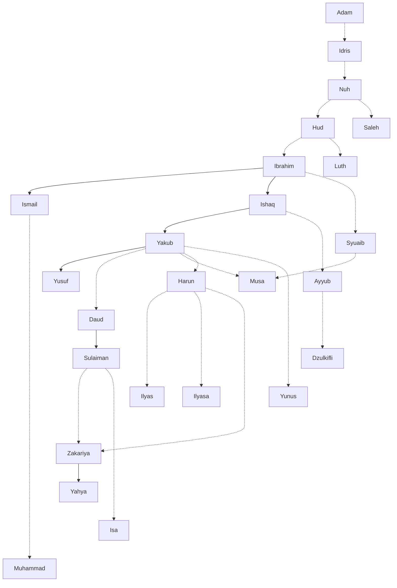

# Geneologi Para Nabi

# Kisah Para Nabi

1. [Adam](adam.md)
2. [Idris](idris.md) 
3. [Nuh](nuh.md)
4. [Hud](hud.md)
5. [Saleh](saleh.md)
6. [Ibrahim](ibrahim.md)
7. [Ismail](ismail.md)
8. [Ishaq](ishaq.md)
9. [Yaqub](yaqub.md)
10. [Yusuf](yusuf.md)
11. [Ayyub](ayyub.md)
12. [Shuaib](shuaib.md)
13. [Musa](musa.md)
14. [Harun](harun.md)
15. [Dzulkifli](dzulkifli.md)
16. [Daud](daud.md)
17. [Sulaiman](sulaiman.md)
18. [Ilyas](ilyas.md)
19. [Ilyasa](ilyasa.md)
20. [Yunus](yunus.md)
21. [Zakariya](zakariya.md)
22. [Yahya](yahya.md)
23. [Isa](isa.md)
24. [Muhammad](muhammad.md)