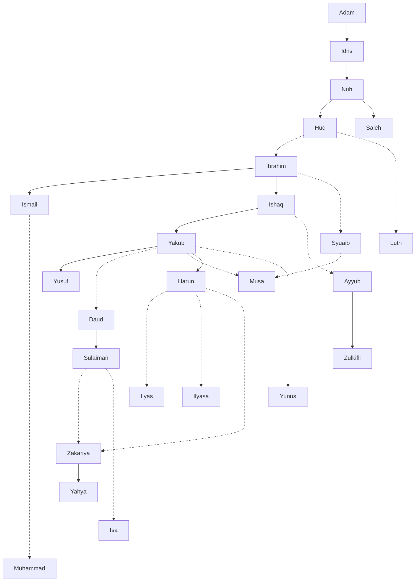

# Geneologi Para Nabi

Klik Nama Nabi untuk mengetahui kisahnya.

```mermaid
graph TD
    Adam -.-> Idris
    Idris -.-> Nuh
    Nuh -.-> Hud
    Nuh -.-> Saleh
    Hud -.-> Ibrahim
    Hud -.-> Luth
    Luth ~~~ Ayyub
    Ibrahim --> Ismail
    Ibrahim --> Ishaq
    Ishaq --> Yakub
    Yakub --> Yusuf
    Ishaq -..-> Ayyub
    Ibrahim -.-> Syuaib
    Syuaib -.-> Musa
    Ayyub ---> Zulkifli
    Yakub -..-> Daud
    Yakub -.-> Musa
    Yakub -.-> Harun
    Daud --> Sulaiman
    Sulaiman -..-> Zakariya
    Sulaiman -.....-> Isa
    Harun -...-> Ilyas
    Harun -...-> Ilyasa
    Harun -.....-> Zakariya
    Yakub -....-> Yunus
    Zakariya --> Yahya
    Ismail -..........-> Muhammad

    click Adam href "https://bagustris.github.io/kisah-nabi/adam"
    click Idris href "https://bagustris.github.io/kisah-nabi/idris"
    click Nuh href "https://bagustris.github.io/kisah-nabi/nuh"
    click Hud href "https://bagustris.github.io/kisah-nabi/hud"
    click Saleh href "https://bagustris.github.io/kisah-nabi/saleh"
    click Ibrahim href "https://bagustris.github.io/kisah-nabi/ibrahim"
    click Ismail href "https://bagustris.github.io/kisah-nabi/ismail"
    click Ishaq href "https://bagustris.github.io/kisah-nabi/ishaq"
    click Yaqub href "https://bagustris.github.io/kisah-nabi/yaqub"
    click Yusuf href "https://bagustris.github.io/kisah-nabi/yusuf"
    click Ayyub href "https://bagustris.github.io/kisah-nabi/ayyub"
    click Shuaib href "https://bagustris.github.io/kisah-nabi/shuaib"
    click Musa href "https://bagustris.github.io/kisah-nabi/musa"
    click Harun href "https://bagustris.github.io/kisah-nabi/harun"
    click Zulkifli href "https://bagustris.github.io/kisah-nabi/zulkifli"
    click Daud href "https://bagustris.github.io/kisah-nabi/daud"
    click Sulaiman href "https://bagustris.github.io/kisah-nabi/sulaiman"
    click Ilyas href "https://bagustris.github.io/kisah-nabi/ilyas"
    click Ilyasa href "https://bagustris.github.io/kisah-nabi/ilyasa"
    click Yunus href "https://bagustris.github.io/kisah-nabi/yunus"
    click Zakariya href "https://bagustris.github.io/kisah-nabi/zakariya"
    click Yahya href "https://bagustris.github.io/kisah-nabi/yahya"
    click Isa href "https://bagustris.github.io/kisah-nabi/isa"
    click Muhammad href "https://bagustris.github.io/kisah-nabi/muhammad"
```

