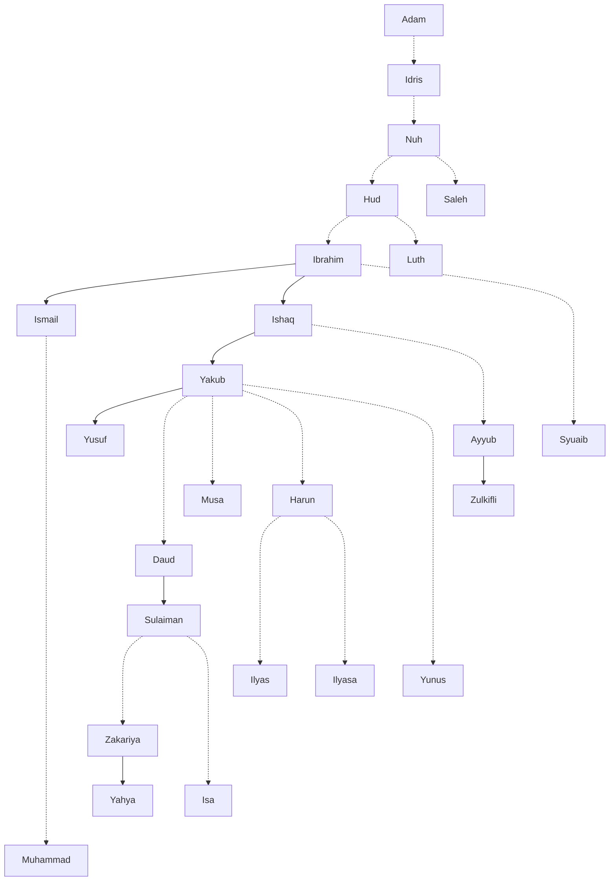

# Genealogi 25 Nabi

Klik Nama Nabi untuk mengetahui kisahnya.

Keterangan:  
- Jalur keturunan diambil dari pihak ayah.
- Cara membaca berdasarkan urutan waktu: dari atas ke bawah, dari kiri ke kanan.
- Panah menunjukkan keturunan langsung (bapak - anak).
- Panah putus-putus menunjukkan keturunan tidak langsung (cucu, cicit, dst).